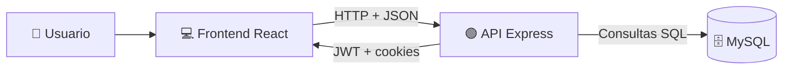

# 📚 GoblinVerse – Documentación del Proyecto

Plataforma full-stack para descubrir y gestionar libros dentro de un universo fantástico.
Incluye **frontend en React**, **backend en Node + Express**, autenticación con **JWT + refresh tokens**, y persistencia en **MySQL**.

---

## 📑 Índice

- [✨ Visión general](#-visión-general)
- [🏗️ Arquitectura general](#️-arquitectura-general)
- [🧰 Tecnologías utilizadas](#-tecnologías-utilizadas)
  - [Frontend](#frontend)
  - [Backend](#backend)
- [📁 Estructura del proyecto](#-estructura-del-proyecto)
- [🎨 Frontend (React)](#-frontend-react)
  - [Rutas principales](#rutas-principales)
  - [Página Principal (`/`)](#página-principal-)
  - [Catálogo (`/catalogo`)](#catálogo-catalogo)
  - [Perfil (`/perfil`)](#perfil-perfil)
  - [Pantalla de Login / Registro (`/login`)](#pantalla-de-login--registro-login)
  - [Componentes compartidos](#componentes-compartidos)
- [🛠️ Backend (Node + Express)](#️-backend-node--express)
  - [Configuración del servidor](#configuración-del-servidor)
  - [Conexión a base de datos](#conexión-a-base-de-datos)
  - [Endpoints de la API](#endpoints-de-la-api)
  - [Middleware de autenticación](#middleware-de-autenticación)
  - [Script de seed de libros](#script-de-seed-de-libros)
- [🗄️ Modelo de datos](#️-modelo-de-datos)
- [🔐 Flujo de autenticación](#-flujo-de-autenticación)
- [⚙️ Variables de entorno](#️-variables-de-entorno)
- [🚀 Puesta en marcha](#-puesta-en-marcha)
- [🧪 Testing y calidad](#-testing-y-calidad)
- [🧭 Roadmap y mejoras futuras](#-roadmap-y-mejoras-futuras)

---

## ✨ Visión general

**GoblinVerse** es una aplicación web que simula la experiencia de una librería fantástica:

- **Frontend**: Single Page Application (SPA) en React con:
  - Página principal con catálogo de libros destacados.
  - Exploración por géneros con tarjetas visuales.
  - Pantalla de **login/registro** moderna y responsiva.
  - Vistas de **catálogo completo** y **perfil de usuario**.
- **Backend**: API REST en Node + Express que ofrece:
  - **Registro** de usuarios.
  - **Login** con generación de access token y refresh token.
  - **Refresco de token** usando cookies HTTP-Only.
  - Endpoints para **usuarios**, **favoritos**, **compras** y **libros**.
- **Base de datos**: MySQL para almacenar usuarios, tokens y catálogo.

El objetivo es tener una base sólida para evolucionar hacia una **librería online completa** con rutas protegidas, carrito de compra y gestión avanzada de usuarios.

---

## 🏗️ Arquitectura general

Arquitectura en tres capas:

- **Cliente (React)**

  - Se ejecuta en `http://localhost:3000`.
  - Consume la API del backend mediante `fetch`.
- **Servidor (Express)**

  - Se ejecuta en `http://localhost:5000`.
  - Expone rutas de autenticación, usuarios y libros.
  - Aplica CORS con `credentials: true` para permitir cookies.
- **Base de datos (MySQL)**

  - BD `basedatosProyecto`.
  - Tablas principales: `usuarios`, `libros`, `favoritos`, `compra`.

Puedes imaginarlo así:



---

## 🧰 Tecnologías utilizadas

### Frontend

- ⚛️ **React** `^19.2.3`
- 🌐 **React Router DOM** `^7.12.0` – Navegación SPA.
- 🧊 **Renderizado 3D**:
  - `three`
  - `@react-three/fiber`
  - `@react-three/drei`
- 🧪 **Testing Library**:
  - `@testing-library/react`
  - `@testing-library/jest-dom`
  - `@testing-library/user-event`
  - `@testing-library/dom`
  - `jsdom`
- 📊 **web-vitals** – métricas de rendimiento.
- 🎨 **Tailwind CSS** `^3.4.19`.
- Otros:
  - `i18next-browser-languagedetector` (preparado para i18n).
  - `jquery`
  - `jsonwebtoken`

### Backend

- 🟢 **Node.js + Express** `^4.18.2`
- 🔐 **jsonwebtoken** – generación y validación de JWT.
- 🔑 **bcryptjs** – hashing de contraseñas.
- 🍪 **cookie-parser** – lectura de cookies (`refreshToken`).
- 🌍 **cors** – configuración CORS con credenciales.
- 🗄️ **mysql2/promise** – conexión con MySQL.
- ⚙️ **dotenv** – gestión de variables de entorno.
- 🌐 **axios** – usado en seeding de libros.
- 🧠 Preparado para sesiones en Redis:
  - `express-session`
  - `connect-redis`
  - `redis`

## 📁 Estructura del proyecto

```text
proyectode0/
├─ package.json
├─ README.md
├─ backend/
│  ├─ package.json
│  ├─ server.js
│  ├─ .env
│  ├─ config/
│  │  ├─ db.js
│  │  └─ seedLibros.js
│  ├─ controllers/
│  │  ├─ authController.js
│  │  ├─ registerController.js
│  │  ├─ refreshTokenController.js
│  │  ├─ usersController.js
│  │  └─ librosController.js
│  ├─ middleware/
│  │  └─ auth.middleware.js
│  └─ routes/
│     └─ auth.js
└─ src/
   ├─ index.js
   ├─ App.js
   ├─ Pages/
   │  ├─ Principal/principal.jsx
   │  ├─ Login/login.jsx
   │  ├─ Catalogo/catalogo.jsx
   │  ├─ Perfil/perfil.jsx
   │  └─ Libros/paginaLibro.jsx
   ├─ Components/
   │  ├─ Header/header.jsx
   │  ├─ Footer/footer.jsx
   │  ├─ MiPerfil/miPerfil.jsx
   │  ├─ MisCompras/misCompras.jsx
   │  └─ Login-Registro/
   ├─ Services/
   │  ├─ funtionGenres.js
   │  ├─ cerrarSesion.js
   │  └─ api.js
   ├─ utils/
   │  └─ utils.js
   └─ Context/
      └─ AuthContext.js
```

---

## 🎨 Frontend (React)

### Rutas principales

En `App.js` se definen las rutas:

- `/` ➝ `Principal`.
- `/login` ➝ `Login`.
- `/perfil` ➝ `Perfil`.
- `/book` ➝ `PageBook` (placeholder actual).
- `/catalogo` ➝ `Catalogo`.

### Página Principal (`/`)

**Componente:** `Principal`

- Fondo oscuro temático y layout responsive.
- Botón “Explorar Catálogo” que navega a `/catalogo`.
- Sección “Nuestras gemas destacadas”:
  - Llama a `POST /librosPublicos`.
  - Renderiza libros con componente 3D `Libro3D`.
- Sección de géneros usando `generosArray`.
- Incluye `Header` y `Footer`.

### Catálogo (`/catalogo`)

**Componente:** `Catalogo`

- Llama a `POST /libros` para traer catálogo completo.
- Envía token en header `Authorization`.
- Renderiza tarjetas de libros en 3D.
- Incluye panel de filtros visuales (UI preparada, sin lógica aún).

### Perfil (`/perfil`)

**Componente:** `Perfil`

- Dashboard con menú lateral.
- Alterna entre:
  - `MiPerfil`: datos del usuario, favoritos y métricas.
  - `MisCompras`: historial de compras.
- Cierre de sesión vía `POST /cerrarSesion` y borrado de token local.
- Renovación automática de token (`POST /refresh`) cuando una ruta protegida responde `401`.

### Pantalla de Login / Registro (`/login`)

**Componente:** `Login`

- Usa `useState` para alternar entre login y registro.
- **Login** (`BotonEnviarLogin`):
  - `POST http://localhost:5000/login`
  - Guarda `token` en `localStorage`.
  - Navega a `/`.
- **Registro** (`BotonEnviarRegistro`):
  - `POST http://localhost:5000/register`
  - Redirige a `/login` si va bien.
- UI lista para futura integración OAuth (Google/Facebook).

### Componentes compartidos

- **Header (`Header`)**:

  - Navegación principal.
  - Botón de usuario dinámico:
    - Con token ➝ `/perfil`.
    - Sin token ➝ `/login`.
- **Footer (`Footer`)**:

  - Pie con copyright del proyecto.
- **Servicios y utilidades**:

  - `Services/funtionGenres.js`: géneros e imágenes.
  - `Services/cerrarSesion.js`: cierre de sesión.
  - `utils/utils.js`:
    - `renovarToken()`
    - `Libro3D`
  - `Services/api.js` y `Context/AuthContext.js`: base preparada para evolución futura.

---

## 🛠️ Backend (Node + Express)

### Configuración del servidor

Archivo: `backend/server.js`

- Crea app Express.
- Middleware:
  - `cors({ origin: 'http://localhost:3000', credentials: true })`
  - `express.json()`
  - `cookieParser()`
- Monta rutas con `app.use('/', authRoutes)`.
- Puerto `5000`.

### Conexión a base de datos

Archivo: `backend/config/db.js`

- Usa `mysql2/promise`.
- Configuración actual:
  - host: `127.0.0.1`
  - port: `3306`
  - user: `root`
  - password: (definida en archivo)
  - database: `basedatosProyecto`
- Exporta `conexionBD()`.

### Endpoints de la API

Archivo: `backend/routes/auth.js`

- `POST /login` ➝ login de usuario.
- `POST /register` ➝ registro de usuario.
- `POST /refresh` ➝ refresco de access token.
- `POST /usuarios` ➝ datos del usuario por token (**protegida**).
- `POST /librosPublicos` ➝ 6 libros destacados.
- `POST /libros` ➝ listado completo de libros.
- `POST /librosFavoritos` ➝ favoritos del usuario (**protegida**).
- `POST /librosComprados` ➝ compras del usuario (**protegida**).
- `POST /eliminarLibro` ➝ elimina favorito por id (**protegida**).
- `POST /cerrarSesion` ➝ invalida refresh token y limpia cookie.

### Middleware de autenticación

Archivo: `backend/middleware/auth.middleware.js`

- Espera `Authorization: Bearer <ACCESS_TOKEN>`.
- Verifica JWT con `JWT_SECRET`.
- Si es válido:
  - carga `req.user`
  - carga `req.id_usuario`
  - ejecuta `next()`
- Si falla:
  - `401` con `Token requerido`, `Token expirado` o `Token inválido`.

### Script de seed de libros

Archivo: `backend/config/seedLibros.js`

- Consulta Open Library (`q=fiction&limit=50`).
- Inserta/actualiza libros en `libros` usando ISBN.
- Usa `ON DUPLICATE KEY UPDATE` para evitar duplicados.

Ejecución:

```bash
cd backend
node config/seedLibros.js
```

---

## 🗄️ Modelo de datos

Basado en las consultas reales del backend, el proyecto usa al menos estas tablas:

### `usuarios`

- `id_usuario` (PRIMARY KEY, AUTO_INCREMENT)
- `nombre_usuario` (VARCHAR)
- `gmail` (VARCHAR UNIQUE)
- `contrasena` (VARCHAR, hash bcrypt)
- `token` (TEXT/VARCHAR)

### `libros`

- `id_libro` (PRIMARY KEY, AUTO_INCREMENT)
- `isbn` (VARCHAR)
- `titulo`
- `autor`
- `categoria`
- `editorial`
- `existencias`
- `url_imagen`
- `descripcion`
- `idioma`

### `favoritos`

- `id_favorito` (PRIMARY KEY)
- `id_user` (FK a `usuarios.id_usuario`)
- `id_libro` (FK a `libros.id_libro`)
- `fecha`

### `compra`

- `id_compra` (PRIMARY KEY)
- `id_user` (FK a `usuarios.id_usuario`)
- `id_libro` (FK a `libros.id_libro`)
- `fecha`

---

## 🔐 Flujo de autenticación

1. **Registro** 📝

   - Usuario completa formulario en `/login` (modo registro).
   - Front envía `POST /register`.
2. **Login** 🔑

   - Front envía `POST /login`.
   - Backend genera access token + refresh token.
   - Guarda refresh en BD y cookie HTTP-Only.
   - Front guarda access token en `localStorage`.
3. **Acceso a rutas protegidas** 🛡️

   - Front envía `Authorization: Bearer <ACCESS_TOKEN>`.
4. **Refresco de token** 🔄

   - Si hay `401`, el front llama `POST /refresh` con `credentials: 'include'`.
   - Si refresh es válido, guarda nuevo access token y reintenta petición.
5. **Cierre de sesión** 🚪

   - Front llama `POST /cerrarSesion`.
   - Backend limpia token en BD y borra cookie `refreshToken`.

---

## ⚙️ Variables de entorno

Definidas en `backend/.env`.

```bash
JWT_SECRET=tu_clave_super_secreta_para_access
JWT_REFRESH_SECRET=tu_clave_super_secreta_para_refresh
JWT_EXPIRES_IN=15m
JWT_REFRESH_EXPIRES_IN=7d
```

---

## 🚀 Puesta en marcha

### Requisitos previos

- Node.js (LTS recomendado).
- MySQL local.

### 1️⃣ Backend

```bash
cd backend
npm install
npm run dev
```

### 2️⃣ Frontend

```bash
cd ..
npm install
npm start
```

### 3️⃣ Seed opcional de libros

```bash
cd backend
node config/seedLibros.js
```

---

## 🧪 Testing y calidad

Dependencias incluidas para pruebas frontend:

- `@testing-library/react`
- `@testing-library/jest-dom`
- `@testing-library/user-event`
- `@testing-library/dom`
- `jsdom`

Ejecución:

```bash
npm test
```

---

## 🧭 Roadmap y mejoras futuras

- Rutas privadas en frontend (`PrivateRoute`).
- Carrito real y checkout.
- CRUD de favoritos y compras desde catálogo.
- Perfil de usuario ampliado.
- Despliegue (frontend + backend + DB).

---

Con todo lo anterior, este README documenta el estado actual del proyecto y las piezas nuevas ya implementadas.
